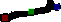
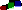
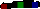
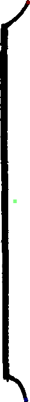
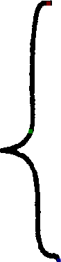

# Line glyphs

This documentation page lists all `LineGlyph` classification labels explicitly known about by Smashcima and defines their start, end, and origin point positions.

> **TODO:** Change barline to a line glyph and add it here.

> Legend:
> - Red = start point
> - Green = origin point (of the glyph's affine space)
> - Blue = end point

## List of line glyphs

- `smufl::stem`
    - Start point = bottom tip of the line
    - End point = top tip of the line
    - Origin = undefined, can be anywhere (default to sprite center)
    - 
- `smashcima::beam`
    - Start point = left tip of the line
    - End point = right tip of the line
    - Origin = undefined, can be anywhere (default to sprite center)
    - 
- `smashcima::beamHook`
    - Start point = left tip of the line
    - End point = right tip of the line
    - Origin = undefined, can be anywhere (default to sprite center)
    - 
- `smashcima::ledgerLine`
    - Start point = left tip of the line
    - End point = right tip of the line
    - Origin = undefined, can be anywhere (default to sprite center)
    - 
- `smufl::bracket`
    - Start point = top tip of the bracket
    - End point = bottom tip of the bracket
    - Origin = undefined, can be anywhere (default to sprite center)
    - 
- `smufl::brace`
    - Start point = top tip of the brace
    - End point = bottom tip of the brace
    - Origin = undefined, can be anywhere (default to sprite center)
    - 
