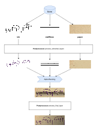

# Compositing

Compositing is the process that stands between the internal, graph-like scene representation and the final image-like 2D output representation. The term is borrowed from computer graphics.

Synthesizers create the scene graph, with all of its glyphs, sprites and affine spaces. Visual scene objects have well-defined positions and there may be multiple view boxes, though which we would like to take a snapshot of the scene.

Certain image-related operations, such as blurring, noise and layer blending are not explicitly captured in the scene. Partly because it would be complicated and impractical, and partly because it would hinder extensibility of these operations as well as the scene itself.

Compositing is the process that defines what exactly happens during the creation of the output image from the scene. And compositing is controlled by a `Compositor`.


## The `Compositor` interface

Each `Model` has a `Compositor` interface implementation registered. The compositor is the sole service responsible for flattening the graph-like scene into an image:

```py
class Compositor(abc.ABC):

    @abc.abstractmethod
    def run(self, view_box: ViewBox, dpi: float) -> ImageLayer:
        """Composits the entire scene into an image layer from the perspective of the provided view box at the requested DPI"""
        raise NotImplementedError
```

The compositor provide one method called `run`, which is given a `ViewBox` into the scene, and the DPI at which we would like to rasterize the scene.

This method has to go through all the `Sprite`s in all the `AfineSpace`s, transform them into the `ViewBox` and flatten them into a single image. It also has to do the same with `LabeledRegion`s, so that we also have all bounding boxes, masks, and labels in the output image.

The `ImageLayer` is a "flattened scene section". It contains the bitmap image (sprites already combined), the DPI at which it was rasterized, and the list of all `LabeledRegion`s inside the original view box, transformed into the pixel-space of the bitmap.

The final `ImageLayer` is what gets fed into the various exporters and renderers, which just convert it to a PNG file, MuNG file, or COCO file.


## Compositing pipeline

While the compositor's `run` method is technically responsible for everything, it does not do all of that by itself. It delegates most of the work to other components:

- `AffineSpaceVisitor` and `ImageLayerBuilder` for sprite and region flattening
- `Postprocessor` for aplication of filters (blur, noise, ink style)

Thus, the primary responsibility of the compositor is to define the compositing pipeline as such:

1. What `ImageLayer`s get extracted from the scene and what they contain.
2. How these layers are filtered separately (by the `Postprocessor`).
3. How these layers are merged and blended into the final `ImageLayer`.
4. How the final layer is filtered (by the `Postprocessor` again).

In most cases, you don't have to define your own compositor. The default one works ok. However you can, if you need to.


## The `DefaultCompositor` pipeline

The `Model` base class automatically registers the `DefaultCompositor` as the compositor to be used.

It defines a pipeline that extracts three `ImageLayer`s:

- `ink`
- `stafflines`
- `paper`

Passes them through the `Postprocessor`, and merges them via their alpha-channel and passes the final layer through the `Postprocessor` once more.

The pipeline is depicted in this diagram:

<!-- https://drive.google.com/file/d/19HDQV_rK6fH2e5kKUrnLNsxH6QqefdqS/view?usp=drive_link -->


This pipeline lets you define a `Postprocessor` that can filter the major parts of a music document independently or jointly, while still remaining relatively simple and easy to understand.

The default `Postprocessor` registered by the `Model` class is the `NullPostprocessor`, which does not apply any filters. This makes the whole compositing pipeline result in just a simple alpha-based flattening of the scene.


## Helper services

The compositor uses helper services to perform the scene flattening:

- `AffineSpaceVisitor` extend this class to implement a custom recursive walker over the affine space hierarchy; used to extract and transform sprites and regions
- `ImageLayerBuilder` builds an `ImageLayer` by layering sprites and regions; implements view-box-culling and windowed-sprite-blending to save performance
- `Canvas` implements alpha-premultiplied bitmap merging; very low-level

For more details refer to the source code.
