# Glyphs

This documentation page lists all `Glyph` classification labels explicitly known about by Smashcima and defines their origin point position.

This does not contain `LineGlyph`s. They are documented in a [separate page](line-glyphs.md).

## Clefs

- `smufl::cClef`, `smufl::cClefSmall`
    - Origin = vertically the defining staffline, horizontally the sprite center
    - 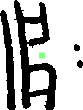
- `smufl::fClef`, `smufl::fClefSmall`
    - Origin = vertically the defining staffline, horizontally the sprite center
    - 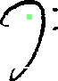
- `smufl::gClef`, `smufl::gClefSmall`
    - Origin = vertically the defining staffline, horizontally the sprite center
    - 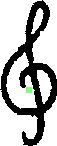

## Time signatures

- `smufl::timeSig0`, `smufl::timeSig1`, `smufl::timeSig2`, `smufl::timeSig3`, `smufl::timeSig4`, `smufl::timeSig5`, `smufl::timeSig6`, `smufl::timeSig7`, `smufl::timeSig8`, `smufl::timeSig9`
    - Origin = center of the sprite
    - 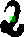
- `smufl::timeSigCommon`, `smufl::timeSigCutCommon`
    - Origin = center of the sprite
    - 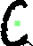

## Noteheads

- `smufl::noteheadWhole`, `smufl::noteheadHalf`
    - Origin = center of the notehead
    - 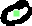
- `smufl::noteheadBlack`
    - Origin = center of the notehead
    - 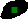

## Augmentation dot

- `smufl::augmentationDot`
    - Origin = center of the dot
    - 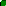

## Flags

- `smufl::flag8thDown`
    - Origin = tip of the corresponding stem
    - 
- `smufl::flag8thUp`
    - Origin = tip of the corresponding stem
    - 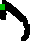
- `smufl::flag16thDown`
    - Origin = tip of the corresponding stem
    - 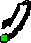
- `smufl::flag16thUp`
    - Origin = tip of the corresponding stem
    - 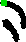

## Accidentals

- `smufl::accidentalFlat`
    - Origin = center of the eye
    - 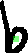
- `smufl::accidentalNatural`
    - Origin = center of the eye
    - 
- `smufl::accidentalSharp`
    - Origin = center of the eye
    - 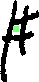
- `smufl::accidentalDoubleSharp`
    - Origin = center of the cross
    - 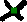

## Articulation

- `smufl::articStaccatoBelow`
    - Origin = center of the dot
    - 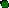

## Rests

- `smufl::restWhole`
    - Origin = vertically the defining staffline, horizontally the sprite center
    - 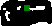
- `smufl::restHalf`
    - Origin = vertically the defining staffline, horizontally the sprite center
    - 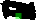
- `smufl::restQuarter`
    - Origin = center of the sprite
    - 
- `smufl::rest8th`
    - Origin = center of the sprite
    - 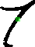
- `smufl::rest16th`
    - Origin = center of the sprite
    - 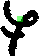
