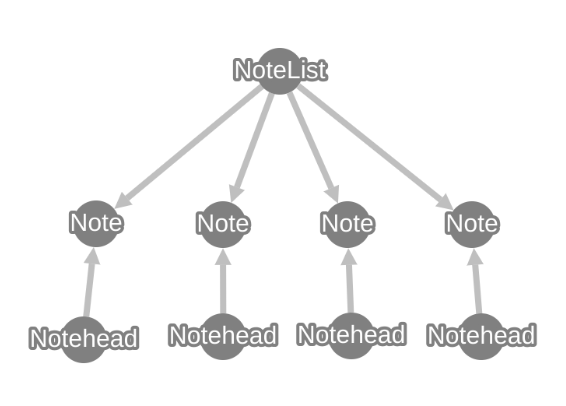
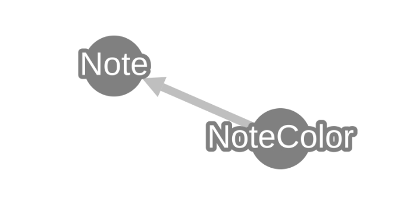

# Scene objects

A scene is the data model produced by synthesizers (and by models), from which we can export the target image and annotation format.

A scene is made up of `SceneObject` instances, that reference each other in a graph-like structure and together describe the contents of a synthetic sheet of music.

The purpose of a scene is to contain all information about a sheet of music and to let the user query this information easily. It's also designed to be easily extensible, drawing on ideas from the [Resource Description Framework (RDF)](https://en.wikipedia.org/wiki/Resource_Description_Framework) used for [Open Data](https://en.wikipedia.org/wiki/Open_data).

> **Note:** The inspiration from RDF is to embrace the graph-like nature of the data model and implement extensibility by extending the graph (say, instead of using class inheritance).


## Understanding the data model by designing scene types from scratch

Let's learn about how `SceneObject`s work by going through the design process of representing music and music notation.

Semantically, music consists of notes. A note is a sound that has some pitch and duration.

To represent pitch, we can use the [Scientific pitch notation](https://en.wikipedia.org/wiki/Scientific_pitch_notation), which is just a combination of a number and a letter. Smashcima provides the type `sc.Pitch` we can use.

Duration is usually not represented by absolute time (milliseconds), instead we use musical time consisting of beats and their subdivisions. Smashcima provides the type `sc.TypeDuration` which represents duration in the "note type units" of "whole", "half", "quarter", etc.

Putting this together, we can define a `Note` scene object:

```py
import smashcima as sc
from dataclasses import dataclass

@dataclass
class Note(sc.SceneObject):
    pitch: sc.Pitch
    """Scientific pitch notation (C4, G2, ...)"""
    
    type_duration: sc.TypeDuration
    """Note-type duration value (whole, half, quarter)"""
```

We can create an instance of a C4 quarter note like this:

```py
my_note = Note(
    pitch=sc.Pitch.parse("4", "C"),
    type_duration=sc.TypeDuration.quarter
)
```

> **Note:** Using the `@dataclass` decorator helps us auto-generate the constructor with all the arguments and verifying that all are provided. It is not necessary to use it though.

Now we can build a \*\*kern loader that reads a `.krn` file and constructs a list of these notes. We can now represent the music semantically (although very simplified for the purpose of this example). We can imagine that the loader returns a `list[Note]` instance which lets us hold the whole score in one variable.

We can then build a synthesizer that generates an image for each note (notehead, stem, flag). For now, we will only consider the notehead:

```py
import numpy as np

@dataclass
class Notehead(sc.SceneObject):
    note: Note
    """The semantic note that this visual notehead represents"""

    image: np.ndarray
    """The synthesized image of this notehead"""
```

Then we can build a renderer, that goes over all noteheads and puts them together into one bitmap for the whole music score.



Here, an interesting problem arises: We hold the score in a variable as a `list[Note]`. How do we get to the noteheads?

1. Currently the `Notehead` references a `Note`. This made sense so far, since we first load the notes and only then add the noteheads. But it prevents us getting to the noteheads from notes.
2. If we invert the relationship and have the `Note` reference a `Notehead`, we have to make the `Notehead` optional (being able to be `None`), otherwise the loader cannot load the notes. But that's incorrect semantically. You cannot have a note in the music score without any notehead. And relaxing this invariant just because of a technical difficulty seems incorrect.

To solve this problem (and many more), the `SceneObject` base class actually tracks all references to-and-from any `SceneObject` instance and remembers them internally. This allows us to query the inverse relationship like this:

```py
print(my_note) # I have my note, I want to get its notehead

# gets the notehead of my_note via the ".note" reference
print(
    Notehead.of(my_note, lambda n: n.note)
)
```

This way, we can pass the `list[Note]` to our renderer and it is able to get to all the noteheads and use them to build the complete image.


### Containers

It also allows us to focus on the semantics of the data and don't let the technical problems get in the way. For example, in music, notes may belong to lots of different containers:

- `Event` Notes with the same onset.
- `Chord` Notes with a shared stem, same onset, and same duration.
- `Beam` Notes sharing a beam.
- `Voice` Notes in the same voice in polyphonic music.
- `Slur` Notes tied by the same slur.
- `Tuplet` Notes being part of the same tuplet.

It's the responsibility of the container to know what notes it contains, NOT the note's to remember what container it belongs to. If it was the note's responsibility, then each time we add another container, we have to extend the `Note` class. That's ugly and hinders extensibility.

At the same time, when synthesizing the music notation, the synthesizer must be able to ask a note about the chord it belongs to, about the slur it belongs to, etc. So we need this inverse querying capability. That's why we inherit from the `SceneObject` base class, which keeps track of all these references (most importantly the back-links).


### Extensibility

Similar issue arises when we build the Smashcima library, but someone else would like to extend it. Let's say you want to build a notation synthesizer that respects notehead colors. You need to store the notehead color in the scene graph somehow.

In your own project, you would be tempted to modify the `Note` class and just add a `color` field to it. But since the `Note` class is part of the Smashcima library and you cannot change the library, you cannot do that.

Another option could be to create a `ColoredNote` class, which inherits from the `Note` class. But this also poses a few problems:

1. How do you construct the `ColoredNote` instance, if the kern loader returns `Note` instances? And if you just copy all the values around, how do you know it won't break with a future update to Smashcima that adds new fields you didn't expect to be added?
2. What if a third person wants to also represent notehead shapes (square, slash, cross). They would build a `ShapedNote` class. But what does the inheritance chain look like now? Does the `ShapedNote` inherit from `ColoredNote` or the other way around? And what if you two don't even know about one another, but a third person wants to use both of your extensions?

You can see how inheritance only leads to hell in this situation.

Instead what I came up with in Smashcima is the ability to just extend the scene graph by adding a few new nodes and attaching them to existing instances:

You can define a `NoteColor` scene object and link it to a note:

```py
@dataclass
class NoteColor(sc.SceneObject):
    color: str
    """The color of the notehead"""

    note: Note
    """The note for which we define the color"""
```

You can add it to the scene graph simply by calling the constructor and throwing it away - the internal link tracking system will keep it referenced:

```py
NoteColor(
    color="red",
    note=my_note
)
```



You can then get the color of a note by doing an inverse query:

```py
print(
    NoteColor.of(my_note, lambda c: c.note).color
) # "red"
```

While inheritance is used in Smashcima in some specific cases, where this inverse querying would be unnecesarily verbose, most of the library is designed to use composition over inheritance.

For example, there is no reason why a `Voice` should be inside `Event` or why `Event` should be inside `Voice`. These two concepts are orthogonal (literally) and should not be nested artificially. The graph design of the scene data model allows for this.


## How `SceneObject` works

Now that you have the motivation for the design, we can talk about how this behaviour is implemented.

The `SceneObject` class overrides the `__setattr__` magic method, so it knows about all situations when anyone is setting any field on the instance (`obj.bar = baz`). When this happens, it updates the scene object's `inlinks` and `outlinks` fields. These fields hold the list of references pointing away from this object, and the list of references pointing towards this object. Each link also knows its `name`, which means you can have more than one link between two object instances.

These links are only tracked between pairs of `SceneObjects`. If only one side is a `SceneObject`, then no link is tracked. This means that scene objects can have fields containing `str`, `int`, `Fraction`, or any other type, and these behave like any other pyhon code. It's only when a scene object "contains" another scene object. In that case you cannot really say it "contains" that object. Rather, you should think about "referencing" that object in the scene graph.


### Lists and `None`

Scene objects can also reference other scene objects optionally, e.g. having a field with type `Optional[Note]`. The type annotation is ignored by the scene object, but the fact of setting the reference to `None` deletes the link from the scene graph.

Similarly, a scene object can reference a list of objects (e.g. a `Voice` references a list of `Note`s). When a `SceneObject` is assigned a `list` instance, the logic goes through the list and creates a graph link to all of the contained scene objects (while ignoring plain python types).

Note that, since all of this logic happens in `__setattr__` magic method, the system does not pick up `.append` or `.pop` or `del list[4]` or `+= [item]` invocations. If you want to modify a list of scene objects, you have to construct a new list and then set it using `obj.list = new_list`! Another words, you should treat the list as being immutable.

> **Warning:** If you do call `.append` on a list of scene object, you will de-synchronize the graph links from the python instance values and this will result in unexpected behaviour when querying those links. There is no safety logic that would detect that!


### Memory leaks

Because scene objects track these back-references, it's very easy to leak memory, since objects are being referenced even when they would not be in plain python code. For example, creating the `NoteColor` instance in this way makes it attached to the `Note` instance and it will never be garbage collected, unless the `my_note` instance can also be garbage collected at the same time:

```py
my_note_color = NoteColor(
    color="red",
    note=my_note
)
```


### Detaching objects from scene

Because if this linking behaviour, if you want to throw away part of the scene (to replace it, or just to completely delete it), you cannot just forget about it. You have to also break its references to the rest of the scene.

For example, to destroy the `NoteColor` instance we created earlier, we need to set its reference to the `Note` to `None`:

```py
my_note_color.note = None
```

Only now will the `my_note_color` instance be garbage collected.

Because this operation makes sense for many scene objects, but the way in which to achieve it depends on the semantics (you need to know, which reference is THE reference that links this sub-scene to the rest of the scene), you must implement this logic manually (it cannot be provided by default by the `SceneObject` class).

When you encapsulate this detachment logic into a method, the convention is to call this method `detach()`:

```py
@dataclass
class Notehead(sc.SceneObject):
    note: Note
    image: np.ndarray

    def detach(self):
        """Break all links with the rest of the scene"""
        self.note = None # type: ignore
```

Also note that you cannot really *destroy* a python class instance. Only the garbage collector can do that. And only when no live instances point to it. Doing `del my_note_color` only deletes the local variable, NOT the instance. You can still get hold of the instance via `my_note.inlinks`. That's why you need a dedicated `detach()` method that breaks these links.


## Relationship querying

Since a `Notehead` points to a `Note`, traversing this forward link is as simple as accessing a python field:

```py
# get the Note of a Notehead
my_note = my_notehead.note
```

The special syntax is only needed when we do the reverse querying:

```py
# get the Notehead of a Note
my_notehead: Notehead \
    = Notehead.of(my_note, lambda n: n.note)
```

The `.of` method is a class-method defined on the `SceneObject`, meaning it will be available on every type ingeriting from the `SceneObject` and it always returns the specific type (e.g. `Notehead`).

If the scene link may not exist (and it is ok for it not to exist), you can instruct the query to return `None` in such cases:

```py
# get Stem for a Notehead (which may not exist)
my_stem: Optional[Stem] \
    = Stem.of_or_none(my_notehead, lambda: s: s.noteheads)
```

Note that the stem also points to a list of `noteheads` and the query also works as expected.

Lastly, you might want to ask for a list of scene objects on the other side of a link with a given name:

```py
# get children of an AffineSpace
children: list[AffineSpace] \
    = AffineSpace.many_of(self, lambda s: s.parent_space)
```


### Named queries

While using these generic inverse queries with `lambda` expressions for link names is possible, it's a little bit verbose and hard to read. Instead, when defining a new scene object type, you should provide a set of custom methods that define better names for these queries.

For example, we can extend the `Notehead` class to define the query to get a notehead for a corresponding `Note`:

```py
class Notehead(sc.SceneObject):
    # ...

    @classmethod
    def of_note(cls, note: Note):
        return cls.of(note, lambda n: n.note)
```

Now we can get the notehead with much shorter and more readable code:

```py
# get the Notehead of a Note
my_notehead = Notehead.of_note(my_note)
```

Similar method could be added for stems:

```py
class Stem(sc.SceneObject):
    # ...

    @classmethod
    def of_notehead_or_none(cls, notehead: Notehead):
        return cls.of_or_none(notehead, lambda s: s.notes)
```

When doing this, please keep the terminology consistent:

- `X.of_Y` to get `X` that should always exist for `Y` and should raise an exception if missing
- `X.of_Y_or_none` to get `X` that may sometimes not exist and should return `None` in such case
- `X.of_many_Y` to get a `list[X]`, which may also be an empty list


## When to use the `Scene` class

So far, all scene objects lived in custom variables as python instances. You don't really need a container (such as a `Scene`) when creating scene objects. However sometimes you want to return a disjoint group of `SceneObject`s as a single object. For that purpose there exists the `sc.Scene` type.

One place where this type might be used is when defining a return type of a `Model` type. Models are supposed to return scenes - the specifics of the scene depend on the model and the domain it models, but the scene class can inherit from `sc.Scene` to utilize some of its pre-defined logic (like recursive scene object addition and closure addition).

You can add scene objects into a scene like this:

```py
scene = sc.Scene(
    root_space=sc.AffineSpace()
)

scene.add(my_note)
```

The scene holds one `AffineSpace` as a root affine space, which may be used as a starting point when traversing visual scene objects.

Objects added into a scene are added with all other linked objects (to and from).

We can also check that the added note also added its notehead:

```py
scene.has(my_notehead) # returns True
```

> **Note:** The precise responsibility of the `sc.Scene` class is not quite defined and it might happen that it gets sharpen, modified, or dropped in the future. It's partly a relict from times when scene objects needed to be in a container.


## Conclusion

This documentation page talks about `SceneObject`s in the abstract. But that's just the very core of Smashcima. You then also have a libarary of already pre-defined scene objects with fixed meaning that can be used to desribe a synthetic sheet of music. The rest of the scene documentation talks about those.
