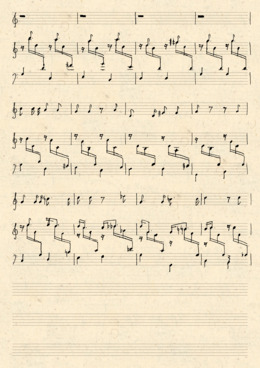
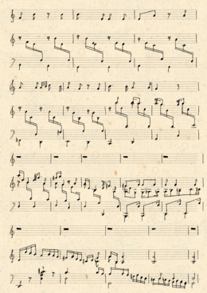
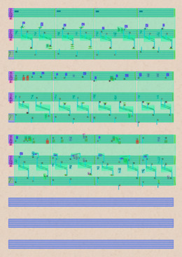

# Producing music notation images

This tutorial shows you by-example how you can use Smashcima to generate synthetic data.


## Context

You typically want to use synthetic training data to solve a specific problem. You might have an existing evaluation dataset and you know what it looks like. You'd like to create synthetic data that mimics that target evaluation dataset, so that you can train a machine learning model on it.

Smashcima works with the notion of a `Model`. A model is a function that, when invoked, produces a synthetic training sample. It's called a model, because it's a *generative model*, describing the resulting synthetic dataset.

Smashcima then is a framework for building custom models, but it also comes with pre-defined models that you can use as-is, or just configure to bend them to your needs.


## Invoking a model

The core model that comes with smashcima is the `BaseHandwrittenModel`. It uses the MUSCIMA++ dataset symbols to produce synthetic handwritten music notation.

The model takes in musical content in the form of MusicXML and produces the corresponding number of music notation pages. You can test it on this [example music score](../assets/tutorial-1/lc5003150.musicxml) taken from the [OpenScore Lieder corpus](https://musescore.com/user/27638568/scores/5003150).

Download the MusicXML score and run this code:

```py
import cv2
import smashcima as sc

model = sc.orchestration.BaseHandwrittenModel()
scene = model("lc5003150.musicxml")

for i, page in enumerate(scene.pages):
    bitmap = scene.render(page)
    cv2.imwrite(f"page_{i}.png", bitmap)
```

First, smashcima starts downloading assets it needs for the synthesis. This happens only during the first invocation. Then these assets are reused, because they are stored in the user's cache directory (`~/.cache/smashcima` on linux).

```
[Smashcima Assets]: Installing bundle MuscimaPP...
Downloading MUSCIMA++ dataset...
Downloading https://lindat.mff.cuni.cz/repository/xmlui/bitstream/handle/11372/LRT-2372/MUSCIMA-pp_v1.0.zip
and saving it to /home/jirka/.cache/smashcima/assets/MuscimaPP/MUSCIMA-pp_v1.0.zip
100%|++++++++++| 21.8M/21.8M [00:17<00:00, 1.26MiB/s]
Extracting the zip...
Checking bundle directory structure...
[Smashcima Assets]: Bundle MuscimaPP installed.
[Smashcima Assets]: Installing bundle MuscimaPPGlyphs...
100%|++++++++++| 140/140 [02:17<00:00,  1.02it/s]
Writing... /home/jirka/.cache/smashcima/assets/MuscimaPPGlyphs/symbol_repository.pkl
[Smashcima Assets]: Bundle MuscimaPPGlyphs installed.
[Smashcima Assets]: Installing bundle MzkPaperPatches...
Downloading MZK paper patches...
100%|++++++++++| 10/10 [00:06<00:00,  1.52it/s]
[Smashcima Assets]: Bundle MzkPaperPatches installed.
```

The two pages are synthesized, with the layout information preserved (measures per system, systems per page):




This model by default rasterizes the scene at 300 DPI, so the two resulting images are both 2582x3652 pixels.


## The scene

What inputs and outputs the model has is completely up to the model, since this depends on the domain it generates. For exmaple, you could build a model that creates MusicXML data out of thin air, in which case it would have signature `model(void) -> str`. But since smashcima focuses primarily on visual data, we call the value returned from the model a *Scene*.

Notice that the model does not return the `np.ndarray` bitmaps directly, instead it returns a custom object that contains much more data than just the images. In fact, it contains almost all the data imaginable in the form of a graph of so-called *scene objects*. This includes the individual glyphs, their masks, bounding boxes, classification labels, stafflines and also the semantics loaded from the MusicXML file and its mapping onto the visual *scene objects*.


## Exporting

For convenience, the scene defines the `render` method, which just constructs a `BitmapRenderer` exporter and invokes it on the scene, producing the final bitmap. See the `smashcima.exporting` module for a list of available exporters.

For debugging purposes there's also the SVG exporter, which you can invoke on the first page with the labeled regions overlay enabled like this:

```py
exporter = sc.exporting.SvgExporter(
    render_labeled_regions=True
)
svg = exporter.export_string(
    scene.pages[0].view_box
)

# write SVG to a file
# (and you can open that in a web browser or Inkscape)
with open("page_0.svg", "w") as f:
    f.write(svg)
```




## Conclusion

You've learned how to use the top-level concepts of smashcima (models, assets, scenes, and exporters). If you want to learn more about each, take a look at the documentation. Otherwise continue with the next tutorial, which will teach you how to modify the `BaseHandwrittenModel`, so that it produces only white or transparent background.
