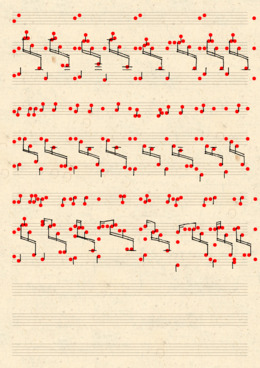

# Tutorial 3: Using custom glyphs

This tutorial shows how you can provide your own set of glyphs for synthesis.


## Glyph synthesizer

In the previous tutorial we explored how a *Model* is really just a collection of synthesizers, that are configured and wired together. One of these synthesizers is the `GlyphSynthesizer`. It's responsible for creating `Glyph`s - scene objects that consist of an image, segmentation mask, and a classification label.

The `smashcima.synthesis.GlyphSynthesizer` is just an interface (python abstract base class) with two methods to be implemented:

```py
import smashcima as sc

class MyGlyphSynthesizer(sc.GlyphSynthesizer):
    def supports_label(self, label: str) -> bool:
        return # true if we can create this glyph type #

    def create_glyph(self, label: str) -> sc.Glyph:
        return # create requested glyph here #
```

The first method is an introspection API that lets the user check, whether the currently used glyph synthesizer supports all the requested glyph types (classification labels).

Since we're building a dummy synthesizer, we will return `True` always:

```py
def supports_label(self, label: str):
    return True
```


## Classification labels

The string argument to both functions is the classification label of the requested glyph. It's allowed to be any string, but Smashcima comes with two sets of pre-defined labels that should suite most use cases.


First is the `sc.SmuflLabels` enum. It contains most of the important classes present in the [SMuFL standard](https://www.smufl.org/). Because the enum is not a string, don't forget to ask for the `.value` when getting the underlying string value. Here's a list of the few common glyph labels:

```py
print(sc.SmuflLabels.noteheadWhole.value) # "smufl::noteheadWhole"
print(sc.SmuflLabels.noteheadBlack.value) # "smufl::noteheadBlack"
print(sc.SmuflLabels.restQuarter.value)   # "smufl::restQuarter"
```

Because SMuFL is not really built to describe line-like glyphs (beams, stafflines) and because some glyphs are missing (individual flag strokes), there's also the `sc.SmashcimaLabel` enum which contains these additional glyph labels.

```py
print(sc.SmashcimaLabels.beam.value) # "smashcima::beam"
print(sc.SmashcimaLabels.staffMeasure.value) # "smashcima::staffMeasure"
```


## Constructing a glyph

A `Glyph` is a scene object that represents a visual unit of music notation. It carries its own `AffineSpace` which defines the glyph's local coordinate system. Then it contains a list of `Sprite`s, where a sprite is just a raster image (OpenCV BGRA uint8 bitmap as a 3D numpy array) together with its DPI (for scaling) and its placement within an affine space. Lastly it contains a `LabeledRegion`, which is a set of polygons in the affine space, encapsulating some 2D area (i.e. the segmentation mask of the glyph).

Let's explore those pieces one by one.


### Affine space

At the core of Smashcima's visual scene objects is the `AffineSpace`. It defines a coordinate system and acts as a parent for various visual scene objects. Affine spaces can be nested in a hierarchy, similar to how most raster graphics software operates (for example SVG's `<g>` group element). Affine space contains an affine `Transform`, which describes the coordinate transformation matrix from this space to the parent's space (another words, it defines how is this space placed within the parent space). The root space has `None` parent and its transform is ignored.

A glyph has its own `AffineSpace` and when it's returned from the synthesizer, it must be a root space (have no parent) and its transform will be set later, when the glyph is positioned in the parent space (so we can leave it at default, which is identity transform).

The scene visual hierarchy has unit-less coordinates, but the convention is to assume that one unit is one millimeter. This is preserved throughout Smashcima, as the affine space hierarchy should ideally only translate and rotate, but not shear, nor scale. The scale of objects should be preserved to keep the unit corresponding to one millimeter. Various internal DPI calculations depend on this assumption.

The coordinate system is assumed to have the X axis as the first dimension, increasing to the right (on the screen) and Y axis as the second dimension, increasing down (on the screen). This is the standard 2D computer graphics setup.

This is how we can create a new affine space:

```py
space = sc.AffineSpace()
```


### Sprite

Sprite is a raster image, placed in an affine space.

Smashcima uses the OpenCV bitmap format and it always has the BGRA 4-channel, uint8 format. So the numpy array shape is `[height, width, 4]`.

We will create a 3x3 millimeter red circle sprite, centered on the origin of the parent affine space. The sprite will have the resolution of 300 DPI, which translates to 36x36 pixels.

```py
import numpy as np
import cv2

# size in pixels
size = int(sc.mm_to_px(3, dpi=300))

# BGRA bitmap with red centered circle
bitmap = np.zeros(shape=(size, size, 4), dtype=np.uint8)
cv2.circle(
    img=bitmap,
    center=(size // 2, size // 2),
    radius=size // 2,
    color=(0, 0, 255, 255), # BGRA
    thickness=-1
)

# construct the sprite instance
# with the affine space created earlier
sprite = sc.Sprite(
    space=space,
    bitmap=bitmap,
    bitmap_origin=sc.Point(0.5, 0.5),
    dpi=300,
    transform=sc.Transform.identity()
)
```

The `bitmap_origin` value is a 0.0 to 1.0 in X, Y axes, which specifies where does the bitmap has its origin (where in the pixel image should the affine space origin line up). The `dpi` field spcifies the sprite scale, with the origin fixed in place.

The `transform` is an affine transform that allows you to position the bitmap origin in the parent affine space somewhere else, than over the affine space origin. If you want to place the sprite at `(50, 20)` in the affine space, you can provide a translation transform `sc.Transform.translate(sc.Vector2(50, 20))`.


### Labeled region

Lastly, the glyph has to specify the segmentation mask with a label, to allow for automatic generation of bounding boxes from any viewport.

This can be done quickly by utilizing the alpha-channel on our sprite. There's a built-in method that uses the `cv2.findContours` method, applied to the 50% thresholded alpha-channel of the sprite. This returns a jagged polygon tracing all the glyph pixels.

```py
region: sc.LabeledRegion = sc.Glyph.build_region_from_sprites_alpha_channel(
    label="smufl::noteheadBlack", # we will set the requested label instead
    sprites=[sprite]
)
```

The constructed `LabeledRegion` is created in the same `AffineSpace` as the given sprites live. It is automatically attached under that space:

```py
assert region.space is sprite.space # succeeds!
assert region.space is space # succeeds!
```


## Putting it all together

When we take all of this code and put it into the glyph syntehsizer, we get this:

```py
class RedCircleGlyphSynth(sc.GlyphSynthesizer):
    def supports_label(self, label: str) -> bool:
        return True

    def create_glyph(self, label: str) -> sc.Glyph:
        space = sc.AffineSpace()

        size = int(sc.mm_to_px(3, dpi=300))
        bitmap = np.zeros(shape=(size, size, 4), dtype=np.uint8)
        cv2.circle(
            img=bitmap,
            center=(size // 2, size // 2),
            radius=size // 2,
            color=(0, 0, 255, 255), # BGRA
            thickness=-1
        )

        sprite = sc.Sprite(
            space=space,
            bitmap=bitmap,
            bitmap_origin=sc.Point(0.5, 0.5),
            dpi=300,
            transform=sc.Transform.identity()
        )

        return sc.Glyph(
            space=space,
            region=sc.Glyph.build_region_from_sprites_alpha_channel(
                label=label,
                sprites=[sprite]
            ),
            sprites=[sprite]
        )
```

Next, we modify the `BaseHandwrittenModel` to use our glyph synthesizer instead of the default MUSCIMA++ synthesizer:

```py
class RedCircleModel(sc.orchestration.BaseHandwrittenModel):
    def register_services(self):
        super().register_services()

        # register a different implementation for the interface        
        self.container.interface(
            sc.GlyphSynthesizer,
            RedCircleGlyphSynth
        )
```

Finally, we execute the model:

```py
model = RedCircleModel()
scene = model("my-input-file.musicxml")

bitmap = scene.render(scene.pages[0])
cv2.imwrite("red-circles.png", bitmap)
```




## Glyphs and line glyphs

You can see that the resulting image still contains stafflines, beams, and stems.

Stafflines are special, they are synthesized using a `StafflinesSynthesizer` and they completely side-step the `GlyphSynthesizer` interface (because they come with their own non-affine coordinate system and lots of specifics).

Beams and stems are synthesized separately, because they are `LineGlyph`s. A `LineGlyph` inherits from `Glyph`, so it has all the same properties, but it has two points - the starting and the ending point. These two points are also used to synthesize line glyphs, so the `LineGlyphSynthesizer` interface has a slightly different API. Overriding those is analogous to regular glyphs.

While line glyphs have these two special points, regular glyphs have only one - the affine space origin point. This point is used to place glyphs into the scene by the music notation synthesizer. Where exactly this origin point is located in relation to the glyph image depends on the glyph label (glyph type). Most glyphs have the origin as the geometric center (noteheads, rests), but some have it offset to some important location (the 4th line for the G-clef, the eye center of a flat, the touching line for a whole and half rests, etc.). See the documentation on Glyphs to learn more.


## Conclusion

You've learned how to implement a custom glyph synthesizer and use it in a larger model. Overriding other synthesizers is analogous. Now you can read the rest of the documentation to learn in more detail about various parts of the Smashcima framework.
