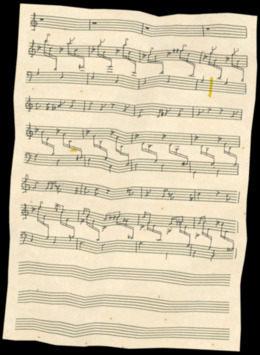

# Tutorial 4: Postprocessing

This tutorial shows how to enable the `BaseHandwrittenPostprocessor` for the `BaseHandwrittenModel` in order to apply a set of image augmentation filters to the resulting image.

The model by default has postprocessing disabled, since the two used libraries by the postprocessor ([Augraphy](https://github.com/sparkfish/augraphy) and [Albumentations](https://albumentations.ai/)) require citations to be given when used.


## Standard model use

To recap, this is the standard way in which you would use the `BaseHandwrittenModel` to generate synthetic images:

```py
import cv2
import smashcima as sc

model = sc.orchestration.BaseHandwrittenModel()
scene = model("my-input-file.musicxml")

for i, page in enumerate(scene.pages):
    bitmap = scene.render(page)
    cv2.imwrite(f"page_{i}.png", bitmap)
```


## Replacing the postprocessor

All you need to do is to replace the `Postprocessor` implementation in the model's services. This is done by inheriting from the base model class and modifying the service registration code:

```py
class MyModel(sc.orchestration.BaseHandwrittenModel):
    def register_services(self):
        super().register_services()
        
        # for postprocessor use the base handwritten one,
        # instead of the default NULL postprocessor
        self.container.type(sc.BaseHandwrittenPostprocessor)
        self.container.interface(
            sc.Postprocessor, # when people ask for this
            sc.BaseHandwrittenPostprocessor # construct this
        )
```

Then after you run the model, the produced bitmap should have postprocessing filters applied:




## Controlling filter stacks

The `BaseHandwrittenPostprocessor` defines a number of filter stacks. These can be manually disabled if needed:

```py
# get the postprocessor instance
p: sc.BaseHandwrittenPostprocessor = model.postprocessor

# never apply camera effects
p.f_camera.force_dont = True

# and always apply scribbles
p.f_scribbles.force_do = True
```


## Citing Augraphy and Albumentations

If you use the `BaseHandwrittenPostprocessor` or you build your own using these libraries, don't forget to cite their respective papers:

- [Augraphy citation](https://github.com/sparkfish/augraphy?tab=readme-ov-file#citations)
- [Albumentations citation](https://github.com/albumentations-team/albumentations?tab=readme-ov-file#citing)


## Conclusion

You've learned how to enable postprocessing on the base model. You can learn more about postprocessing and compositing in the technical documentation of Smashcima.
