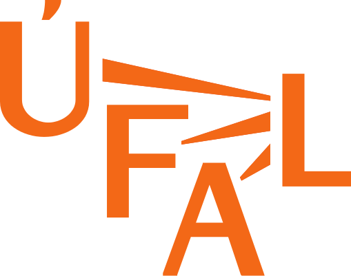
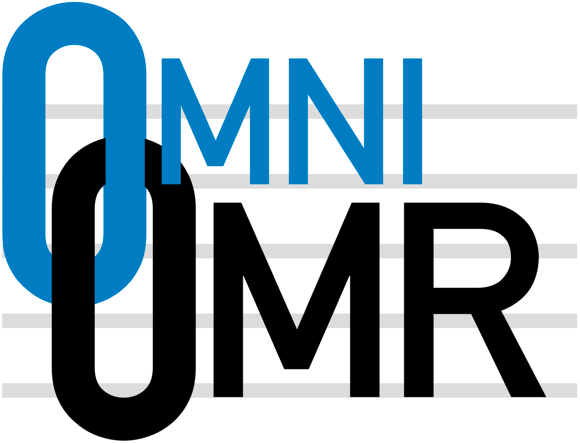

    

2025-03-30

**Mgr. Jiří Mayer, Doc. Pavel Pecina, MgA. Jan Hajič jr., Ph.D.** 
Prague Music Computing Group

> Institute of Formal and Applied Linguistics, 
> Faculty of Mathematics and Physics, 
> Charles University

    
    &nbsp;&nbsp;&nbsp;&nbsp;
    

This work has been done by the OmniOMR project within the 2023-2030 NAKI III programme, supported by the Ministry of Culture of the Czech Republic (DH23P03OVV008).

